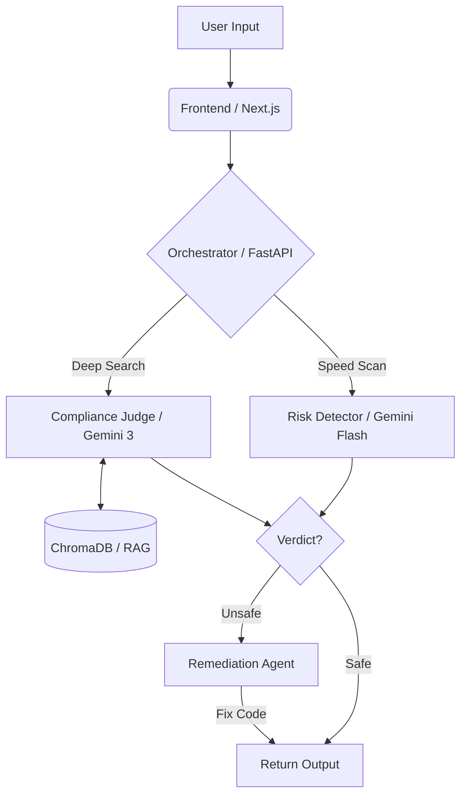

**Instructions:**

1. Go to your GitHub repository.
2. Click on the `README.md` file.
3. Click the **Pencil Icon** (Edit).
4. **Delete everything** currently there.
5. **Copy and Paste** the code block below.
6. Click **"Commit changes"**.

---

```markdown
# 🛡️ TruthForge: Universal AI Compliance Firewall


> **"Don't just trust your AI. Verify it."**
> 
> TruthForge is an autonomous compliance engine that acts as a firewall for Generative AI. It detects hallucinations, verifies facts against real-world laws (HIPAA, GDPR), and **automatically rewrites unsafe code** before it reaches the user.

---

## 🚀 Live Demo
**Try the App:** [https://truthforge-gemini.vercel.app](https://truthforge-gemini.vercel.app)  
**Watch the Video:** [YouTube Link Here]

---

## 🧠 What It Does

Generative AI is powerful but prone to "hallucinations" and security risks. TruthForge solves this by placing a **Multi-Agent System** between the AI and the user.

### 1. ⚡ Real-Time Risk Detection (Gemini Flash)
A high-speed agent scans every user prompt and AI response in milliseconds. It flags PII leaks, insecure code patterns (e.g., HTTP vs HTTPS), and toxic content immediately.

### 2. ⚖️ Deep Compliance Verification (Gemini 3 + RAG)
Instead of guessing, TruthForge retrieves actual legal documents (HIPAA, GDPR, ISO 27001) from a **ChromaDB vector store**. The **Gemini 3** model acts as a "Supreme Court Judge," citing specific legal sections to validate the AI's answer.

### 3. 🛠️ Auto-Remediation Engine
If a violation is found, TruthForge doesn't just block it. The Remediation Agent (powered by **Gemini Pro**) **rewrites the response instantly** to be secure and compliant, turning a "Red Flag" into a "Green Check."

---

## 🏗️ Architecture

The system uses a **Voting Ensemble** architecture where multiple specialized agents must reach a consensus.



---

## 🛠️ Tech Stack

### **Frontend**

* **Framework:** Next.js 14 (App Router)
* **Styling:** Tailwind CSS + Framer Motion
* **Deployment:** Vercel

### **Backend**

* **Framework:** Python FastAPI
* **AI Models:** Google Gemini 3, Gemini Pro, Gemini Flash
* **Vector DB:** ChromaDB (for RAG)
* **Embedding Model:** `sentence-transformers/all-MiniLM-L6-v2`
* **Hosting:** Hugging Face Spaces (Dockerized)

---

## ⚡ Quick Start (Run Locally)

### Prerequisites

* Node.js 18+
* Python 3.10+
* A Google Cloud API Key (Gemini)

### 1. Clone the Repo

```bash
git clone [https://github.com/Rajashekar-017/TruthForge.git](https://github.com/Rajashekar-017/TruthForge.git)
cd TruthForge

```

### 2. Setup Backend

```bash
cd backend
python -m venv venv
# Windows: venv\Scripts\activate  |  Mac: source venv/bin/activate
pip install -r requirements.txt

# Create .env file
echo "GEMINI_API_KEY=your_api_key_here" > .env

# Run Server
uvicorn app.main:app --reload

```

### 3. Setup Frontend

```bash
cd frontend
npm install
npm run dev

```

Open [http://localhost:3000](https://www.google.com/search?q=http://localhost:3000) to see the app.

---

## 🧪 How to Test (For Judges)

Want to see the **Auto-Remediation** in action? Paste this "unsafe" code into the app:

**Input:**

```python
import requests

def send_data(patient_id, data):
    # Sending patient data via HTTP (Not HIPAA Compliant)
    requests.post(f"[http://api.hospital.com/upload/](http://api.hospital.com/upload/){patient_id}", json=data)

```

**What happens:**

1. **Risk Detector:** Flags "HTTP" usage as critical risk.
2. **Compliance Judge:** Cites HIPAA regulations regarding encryption in transit.
3. **Remediation Agent:** **Rewrites the code** to use `https://` and adds error handling.
4. **Result:** You get a verified, secure code snippet.

---

## 🔮 What's Next

* **IDE Extension:** Bring TruthForge verification directly into VS Code.
* **Custom Policies:** Allow companies to upload their own internal PDF rulebooks.
* **CI/CD Integration:** verify code compliance automatically in GitHub Actions.

---

## 👥 Team

* **Rajashekar Reddy** - Full Stack & AI Architecture

---

*Built with ❤️ for the Gemini 3 Hackathon.*

```

```
